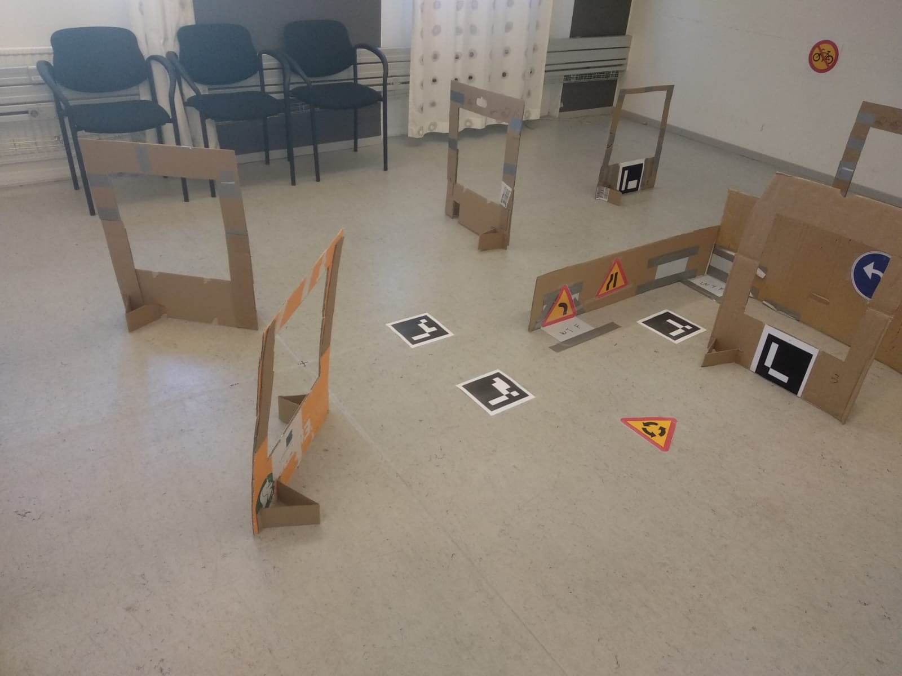

# Autonomous Drone Project
This repository was created for a project course in the department of Electrical Engineering and Computer Science at KTH (Sweden). The task to be solved in the project could be considered as an object search task constrained by having to pass a number of gates at known positions along the way. To assist the system in terms of localization there were a number of markers in the environment. These markers were ArUco markers of known size and known pose. The objects were traffic signs printed on paper. The aim was to navigate along the track defined by the gates while finding objects at the same time.
<table>
  <tbody>
    <tr>
      <td width="75%"></td>
    </tr>
    <tr>
      <td>Figure 1 - Layout of the task to be solved.</td>
    </tr>
  </tbody>
</table>
In addition to gates there could be any number of other obstacles in the environment. An obstacle consists of one or several thin vertical walls. By thin here means something on the order of cardboard. It is thin to reduce the disturbance that the height sensor of the drone gets from it.

The drone used for this course was the Crazyflie, which is a small unmanned aerial vehicle (UAV) produced by the company <a href="https://www.bitcraze.io/">"Bitcraze" and was programed using Python alongside ROS (Robotics Operation System).
