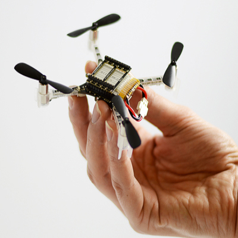

# Autonomous Drone Project
This repository was created for a project course in the department of Electrical Engineering and Computer Science at KTH (Sweden). The task to be solved in the project could be considered as an object search task constrained by having to pass a number of gates at known positions along the way. To assist the system in terms of localization there were a number of markers in the environment. These markers were ArUco markers of known size and known pose. The objects were traffic signs printed on paper. The aim was to navigate along the track defined by the gates while finding objects at the same time.

<p align="center">
    
</p>
In addition to gates there could be any number of other obstacles in the environment. An obstacle consists of one or several thin vertical walls. By thin here means something on the order of cardboard. It is thin to reduce the disturbance that the height sensor of the drone gets from it.

The drone used for this course was the Crazyflie, which is a small unmanned aerial vehicle (UAV) produced by the company <a href="https://www.bitcraze.io/">Bitcraze</a> and was programed using Python alongside ROS (Robotics Operation System).
<p align="center">
    
</p>


The project was divided in mainly three tasks:
<ul>
  <li><b>Perception:</b> Being able to recognize the traffic signs and determine their position in the global map.</li>
  <li><b>Localization:</b> Being able to determine the drone's position in the known map making use of the AruCo markers, whose position is known.</li>
  <li><b>Navigation:</b> Being able to navigate over the 3D track.</li>
</ul>

The block diogram of the system design(including the three tasks) is shown as follows:
<p align="center">
    
</p>

The perception task is developed in [Perception](scripts/perception) subfolder while the latter two are developed in [Navigation](scripts/navigation) subfolder. Each of the subfolders contain another README file focusing on each of the parts and the code developed there.


## How to run the program
The project was developed using Python 2, so a Python 2 interpreter is required. The reader can use the launch files located in the [launch](launch) folder to run the different nodes of the project using the command:

```
$ roslaunch package_name file.launch
```
where package_name is the name of the Catkin package where the launch file is.
Some of the nodes were runned outside the launch file as major problems occurred when running all of them at the same time but this is explained in more detail in each task subsection.

## Demo video and tests
Click the image to watch the final demo => [](https://www.youtube.com/watch?v=9gpehy5qDU0&t=1s)

Click the image to watch the test demo =>[](https://www.youtube.com/watch?v=QIpgcVNhneI)
